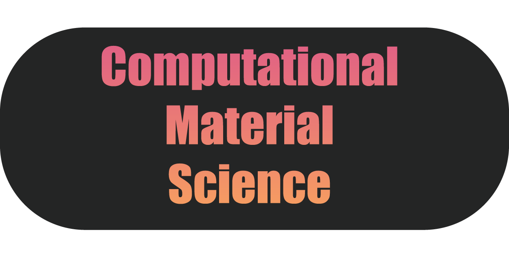

<!-- PROJECT LOGO -->
 

  

  <h3 align="center">Computational Material Science</h3>

  

    A compilation of codes, guides, and excercises for computational material science.
     
    <a href="https://github.com/kimrojas/Computational-Material-Science"><strong>Explore the docs »</strong></a>
     
     
    <a href="https://github.com/kimrojas/Computational-Material-Science">View Demo</a>
    ·
    <a href="https://github.com/kimrojas/Computational-Material-Science/issues">Report Bug</a>
    ·
    <a href="https://github.com/kimrojas/Computational-Material-Science/issues">Request Feature</a>
  

# Table of contents
   * [Title](#gh-md-toc)
   * [Table of contents](#Table-of-contents)
   * [Setting up the environment](#Setting-up-the-environment)
      * [Ubuntu setup standalone](#Ubuntu-setup-standalone)   
      * [Ubuntu setup via WSL 2](###Ubuntu-setup-via-WSL-2)
   * [Setting up the softwares](#Setting-up-the-softwares)
      * [Quantum espresso](#Ubuntu-setup-via-WSL-2)

# Setting up the environment

### Ubuntu setup standalone

- A set of guidelines on a basic Ubuntu setup as a standalone or Virtual machine.   Needs a little more research on making it work with windows (for VM method).    More information here. 

### Ubuntu setup via WSL 2

- A set of guidelines to setup up the WSL 2 on Windows 10 with an **Ubuntu OS**.  Less complicated way of working in windows.   More information here.

# Setting up the softwares

### Intel parallel studio

- A short guide into the installation of Intel-based compilers, mpi, and mkl.   More information here. 

### Python via Anaconda

- A guide to install and use the anaconda python package manager.   More information here. 

### Quantum espresso 

- A guide and build recipe for desktop-based quantum espresso.   A good way to learn and test quantum espresso.   More information here [Intel version]. 

### VASP

- A guide and build recipe for desktop-based VASP.   A good way to test the VASP build.   More information Here.

