<!-- PROJECT LOGO -->
<br />
<p align="center">
  <a href="https://github.com/kimrojas/Computational-Material-Science">
    
  </a>

  <h1 align="center">Ubuntu standalone</h1>

  <p align="center">
    A guide on setting up the Ubuntu OS on fresh install or on a virtual machine. 
    <br />
    <a href="https://github.com/kimrojas/Computational-Material-Science"><strong>Back to Main page »</strong></a>
    <br />
    <br />
    <a href="https://github.com/kimrojas/Computational-Material-Science">View Demo</a>
    ·
    <a href="https://github.com/kimrojas/Computational-Material-Science/issues">Report Bug</a>
    ·
    <a href="https://github.com/kimrojas/Computational-Material-Science/issues">Request Feature</a>
  </p>

# Requirements

1. 50 GB free space
2. Windows 10 system (Mac not tested)
3. 8 GB RAM (minimum) 
4. at least CORE-series Intel CPU (minimum i3 performance)

> For less than 8 GB RAM or less than i3 performance, Either install directly on hardware, switch to Lubuntu OS, or switch to WSL 2.
> These are more lightweight options. Please be responsible of the programs you run in these PCs and take care not to burn your house. Stay safe. 


# Ubuntu ISO image

**Download Ubuntu ISO image from its [website](https://ubuntu.com/download/desktop)**

At the time of writing, the latest ubuntu release is *ubuntu-20.04.1*

> Note: <br> Other flavors of Ubuntu are available that provides a more lightweight variant (for shitty PCs, jk) or a more glorified desktop interface (Mac OS-like)


# Virtual Machine software

**Download [VMware workstation player](https://www.vmware.com/asean/products/workstation-player/workstation-player-evaluation.html)**, version 15.5 as of the time of writing. 

For this guide, I will be using VMware which has a similar process to a hardware install as well.   

>There are three choices for VM software: [VirtualBox](https://www.virtualbox.org/), [VMware workstation player](https://www.vmware.com/asean/products/workstation-player/workstation-player-evaluation.html), and Microsoft Hyper-V. A comparison can be seen [here](https://www.makeuseof.com/tag/virtualbox-vs-vmware-vs-hyper-v/)
>
>- VirtualBox is free but slow
>- Hyper-V is complicated to use and is slow
>- VMware workstation player is limited to 1 VM at a time but is fast.  

# Install VMware Workstation Player

Here we prepare the VMware Workstation Player. Follow the set-by-step closely. 

<p align="center">
  <a>
    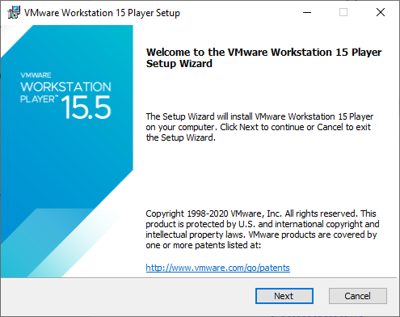
    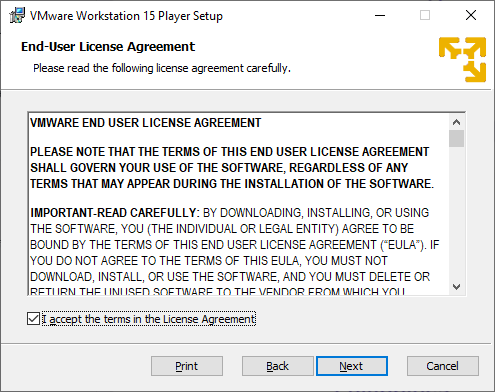 
    <br>
    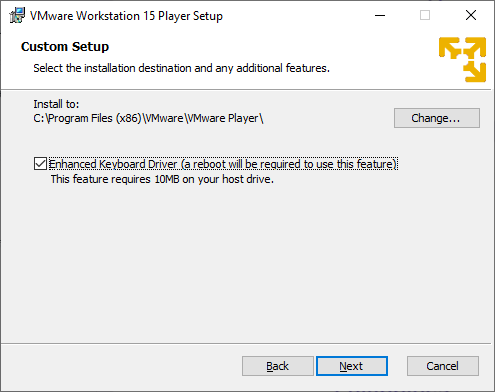
    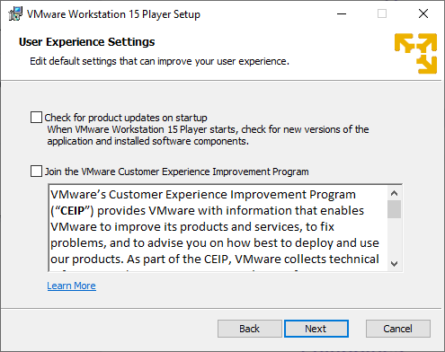
    <br>
    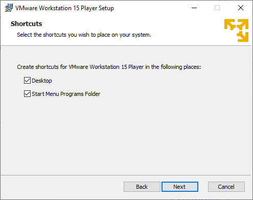
    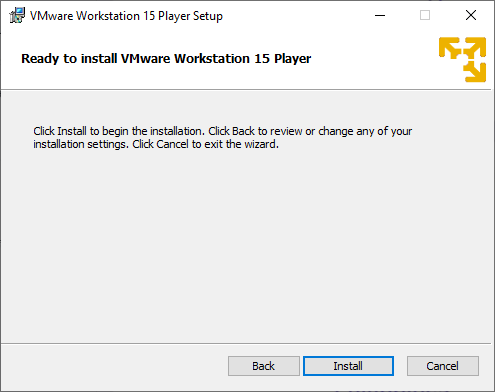
    <br>
    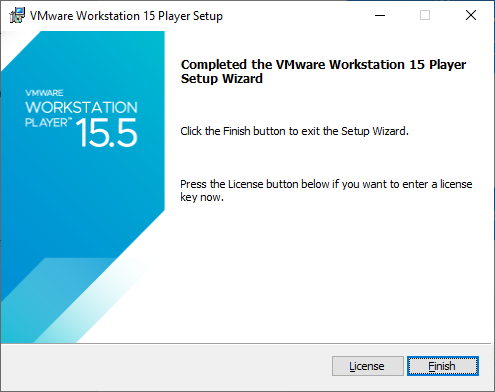
    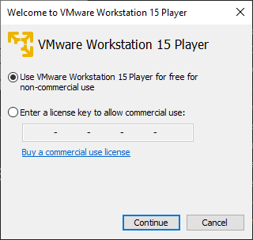
    <br>
    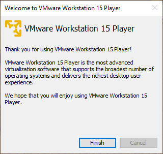
  </a>
</p>

# Create the Ubuntu Virtual machine

Here we craete the Ubuntu Virtual machine. Follow the set-by-step closely.

<p align="left">
A. Run the VMware Workstation Player <br>
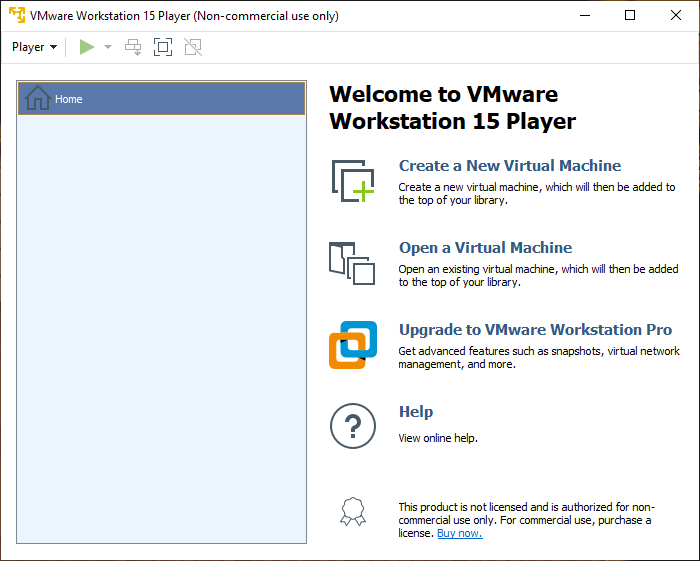 <br>
B. Create a NEW Virtual Machine. Choose <b>"I will install the operating system later"</b> <br>
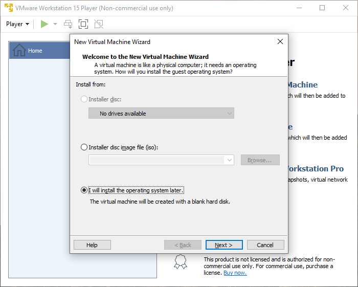 <br>
C. Choose Linux and Ubuntu options <br>
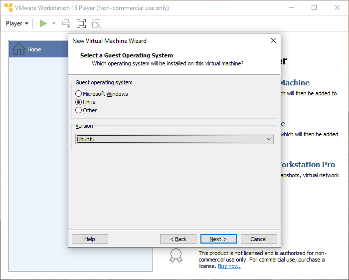 <br>
D. Name the VM and set the save location. <br>
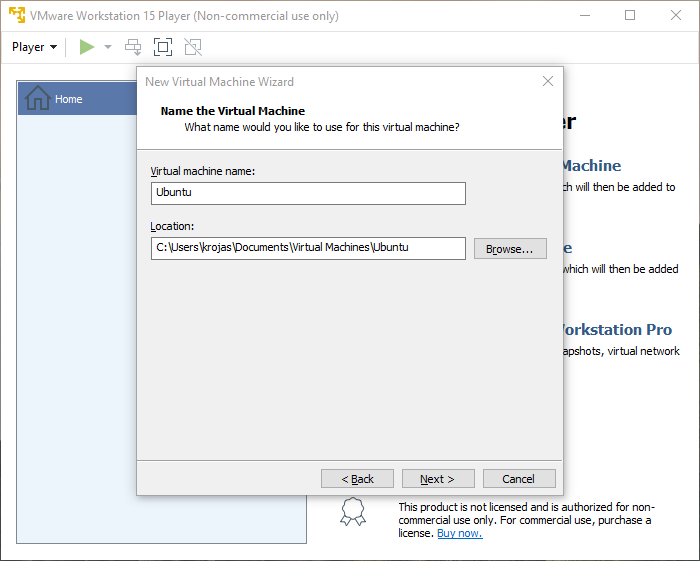 <br>
E. Set maximum disk size at least 50 GB (it takes ~20 GB to setup the compilers and apps). <br>
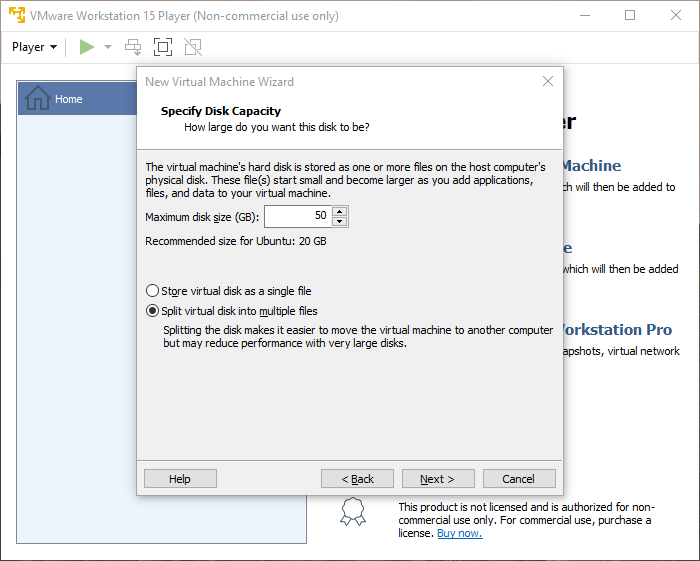 <br>
F. Adjust VM hardware options as needed. <br>
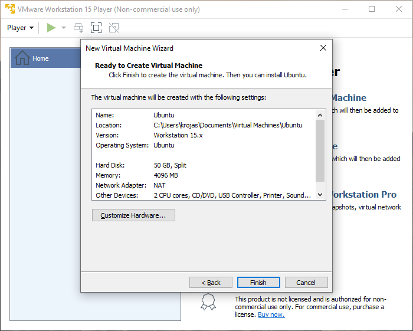 <br>
G. The Ubuntu VM has been setup, but only in name. <br>
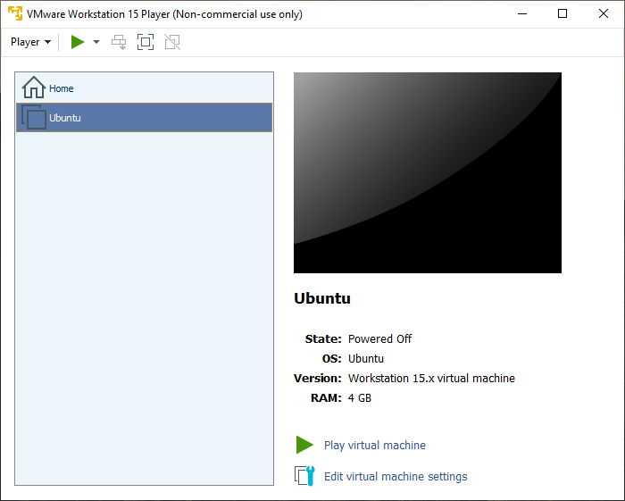 <br>

# Install the Ubuntu OS

The Ubuntu VM has been setup but does not really contain the Ubuntu OS yet. 

**DO NOT TOUCH THE INSTALL TOOL YET**

A. Load the Ubuntu ISO that was downloaded earlier. <br>
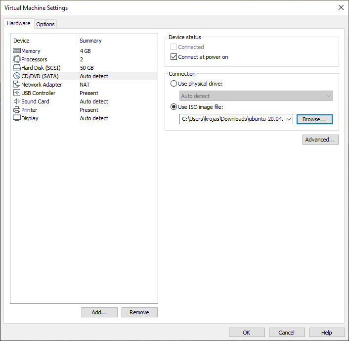 <br>
B. On Software Updates, select <b>Download and Install</b>.<br> <i>(I honestly don't know what it does.. just install)</i> <br>
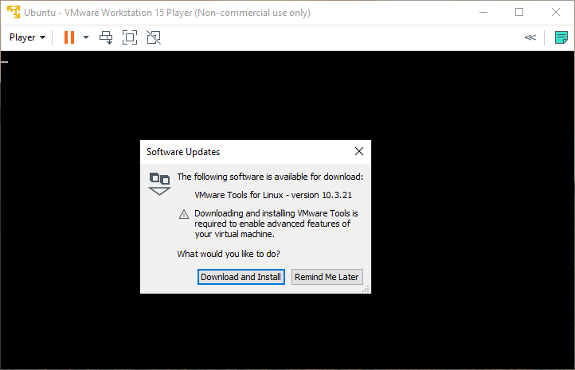 <br>
C. Click `Install` button. <br>
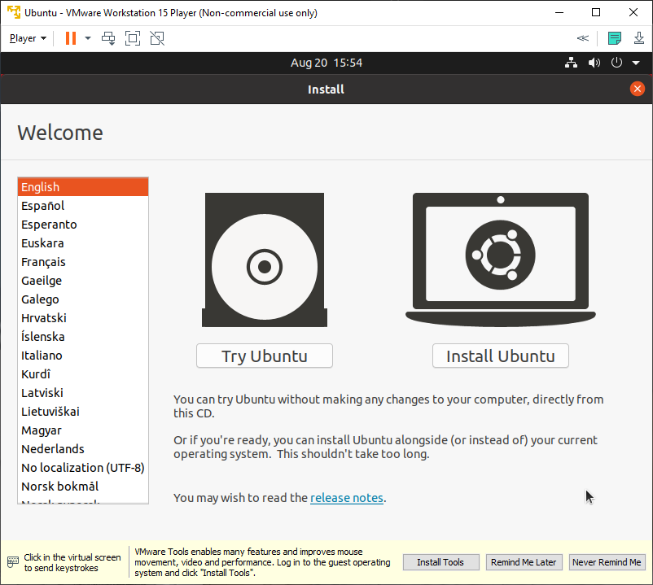 <br>
D. Select you keyboard layout. <br>
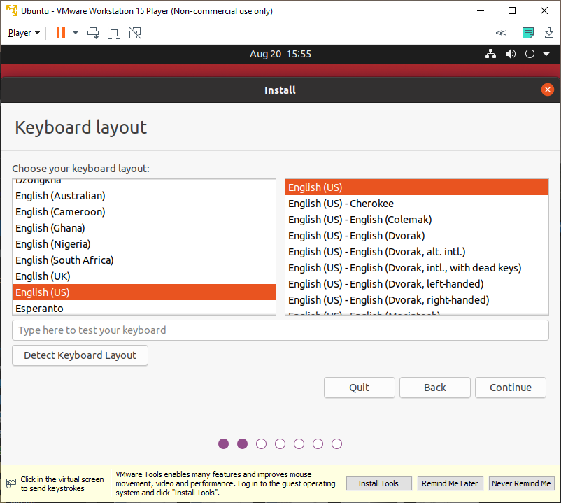 <br>
E. Select Installation type <br>
<i> Minimal installation if you don't need other apps </i><br>
<i> I unselected `other options` 'cause installation takes longer </i> <br>
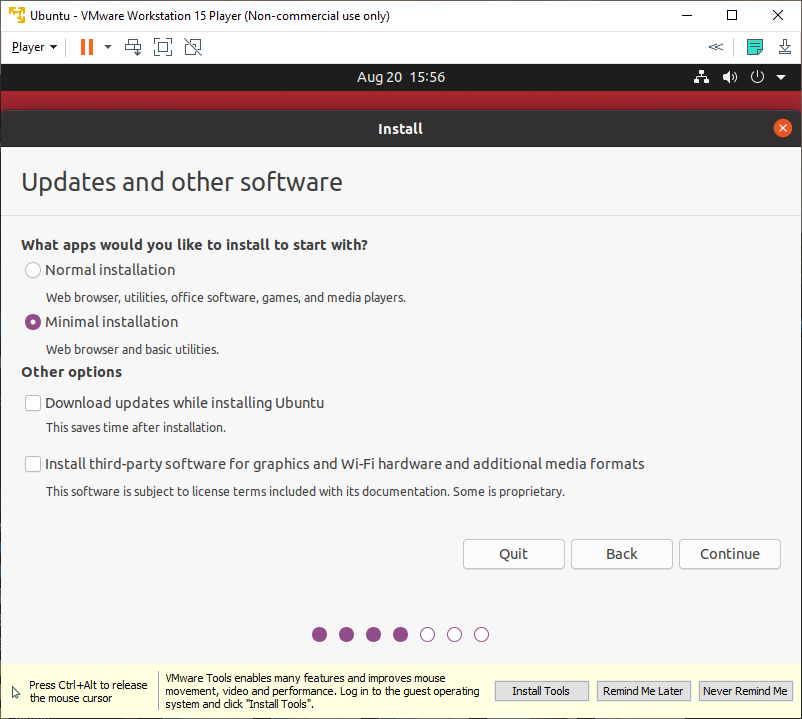 <br>
F. Select `Advanced features` and `Use LVM with the new Ubuntu Installation`. <br>
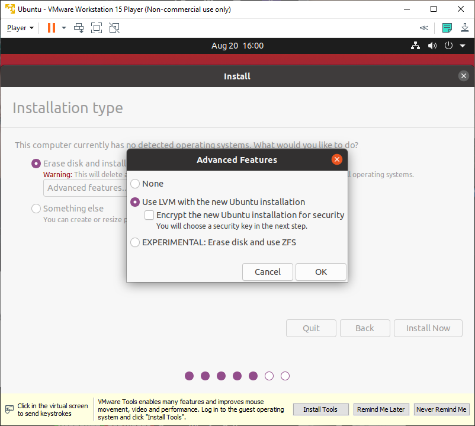 <br>
G. Go through the other steps on your own. You will be prompted to restart and you will end up with this. Click `Remind Me Later` <br>
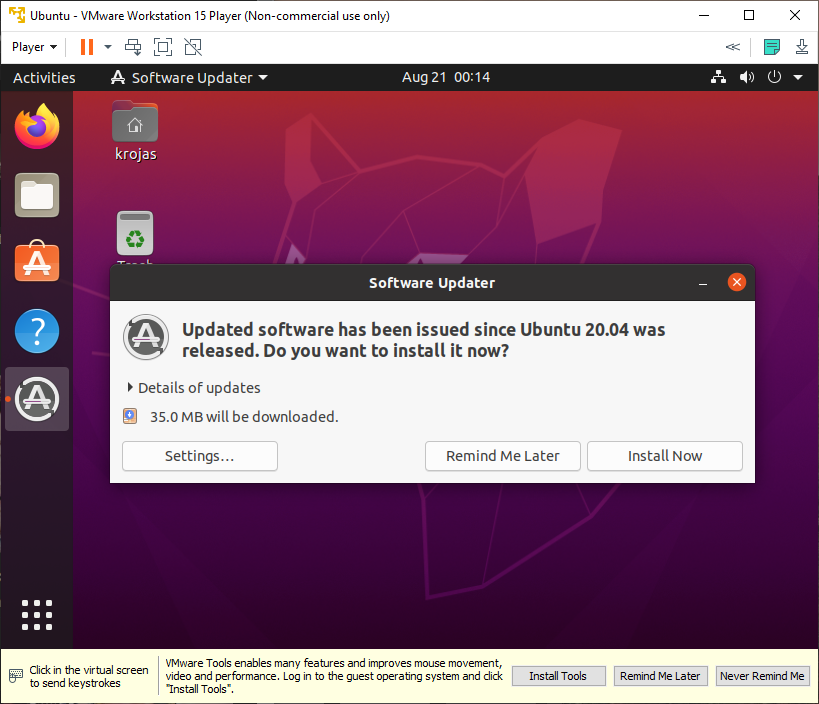 <br>
H. Congratulations! Ubuntu is now installed. <br>
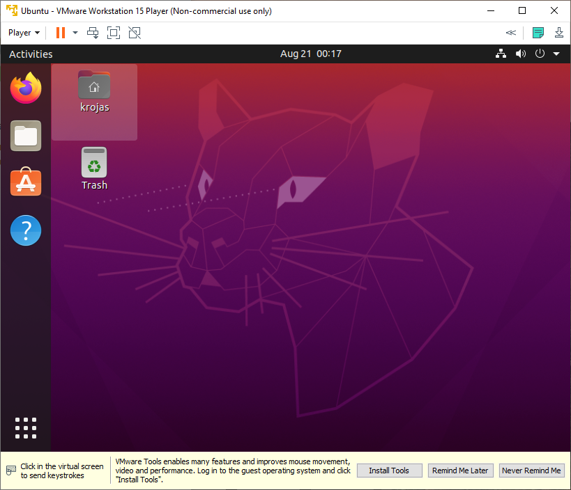 <br>
</p>

# Basic setup for Ubuntu

Open the terminal and type the following commands

```
sudo apt update && sudo apt upgrade
sudo apt install -y vim htop build-essential
```

# Additional setup for VM

This setup will install useful functionalities for cross compatability between the windows and the ubuntu system.

<p>
 <br>
</p>

Here select the `Install tools` button

open the terminal and follow the codes below:
*PLEASE ADAPT THE PATH OF THE `VMware Tools` ACCORDING TO YOUR SYSTEM*

```
# Create a local copy of the installation modules
cp -r /media/krojas/VMware\ Tools ~/
sudo chmod +rw VMware\ Tools/

# untar the zip file
cd VMware\ Tools/ 
tar zxvf VMwareTools-*.tar.gz

# install the functionalities
cd vmware-tools-distrib
sudo ./vmware-install.pl

# Only slect the default options for the next prompts

```
