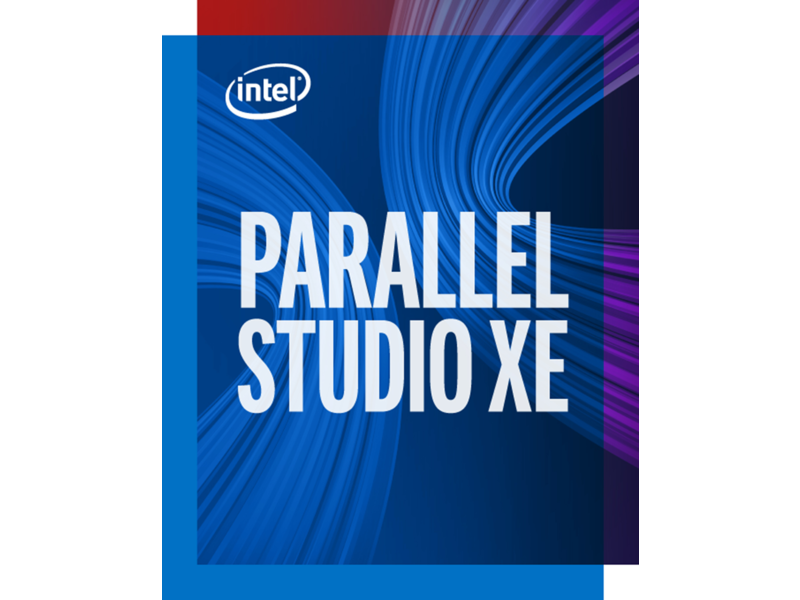

<!-- PROJECT LOGO -->
 

  

  <h1 align="center">Intel Parallel Studio</h1>

  

    A guide on setting up Intel compilerthe Ubuntu OS on fresh install or on a virtual machine. 
     
    <a href="https://github.com/kimrojas/Computational-Material-Science"><strong>Back to Main page »</strong></a>
     
     
    <a href="https://github.com/kimrojas/Computational-Material-Science">View Demo</a>
    ·
    <a href="https://github.com/kimrojas/Computational-Material-Science/issues">Report Bug</a>
    ·
    <a href="https://github.com/kimrojas/Computational-Material-Science/issues">Request Feature</a>
  

> To download and get a license, simply register and apply for a non-commercial license in their website.
> I will assume, you are in any unix environment (Mac, linux, windows wsl)

1. Download Intel Parallel studio [here](https://software.intel.com/content/www/us/en/develop/tools/parallel-studio-xe.html) 

2. untar the downloaded zip file  
`tar zxvf parallel_studio*.tgz`

3. 

